# Documentation

## Walk Trough Application
This app uses React to manage the user interface (UI) and state, Tailwind for styling responsiveness, and LocalStorage to store data when users join a club.

### 1. Navbar 
Each page will have a navigation bar, which is used to navigate between pages. The navigation bar includes "Home," "Club," and "About," which will take you to their respective pages. 

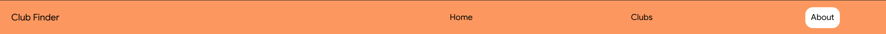

The navbar will also switch to a vertical hamburger menu when users are on non-desktop devices\

### 2. Home
The app starts at "/", which is the home page. The home page features a navigation bar and a "Join Now" button that directs users to /clubs
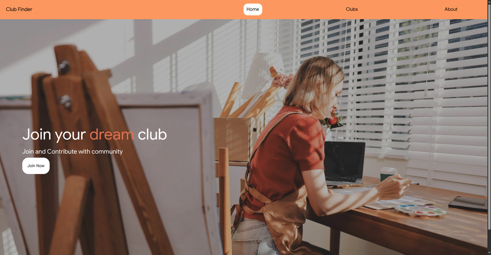

### 3. Clubs
The "/clubs" section features a navigation bar and several club options that users can choose from. This page provides a brief overview of the clubs available to users and includes the following features:
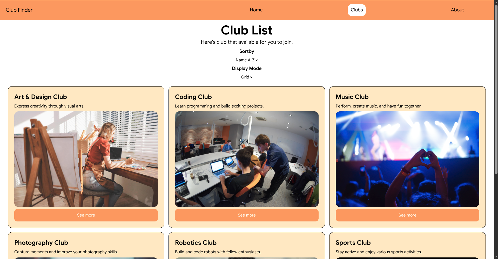

#### 3.1 Sortby
This feature is used to sort clubs according to the user's preference; the options available are A–Z and Z–A.
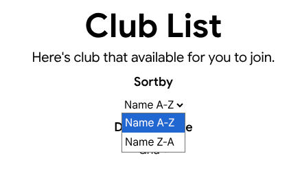

The "A-Z" or "ascending" option is used to sort club names alphabetically. The following is the result of sorting the club names in A-Z or ascending order.

The "Z-A" or ‘descending’ option is used to sort club names in reverse alphabetical order. The following is the result of sorting club names using the "z-a" or "descending" option.
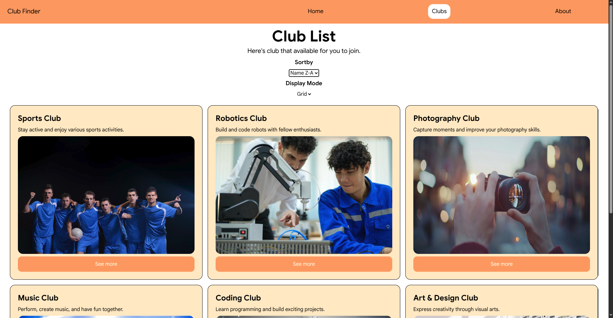

#### 3.2 Mode
Under "/clubs," there is also a feature to change the club display mode; there are two display options: list and grid. \
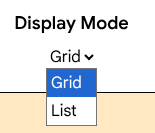

The grid will display the clubs in a grid layout, horizontally, then wrapping to the next row. Here is the result of the grid

The list will display the clubs in a vertical list. Here are the results of the list
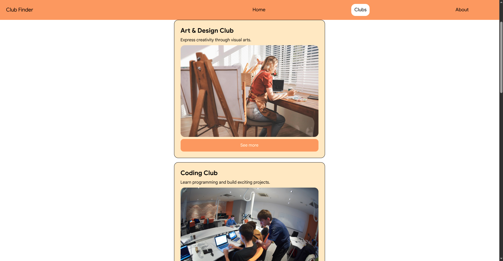

#### 3.3 See more
In the "/clubs" section, each club will have a "See More" button. This button is used to redirect users to "/clubs/:detailClubName". 
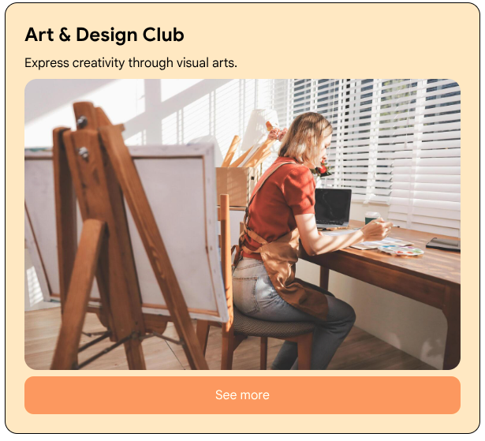

### 4. Clubs/:detailClubName
Here are the results: when you click "See More," you'll be redirected to "/clubs/:detailClubName"
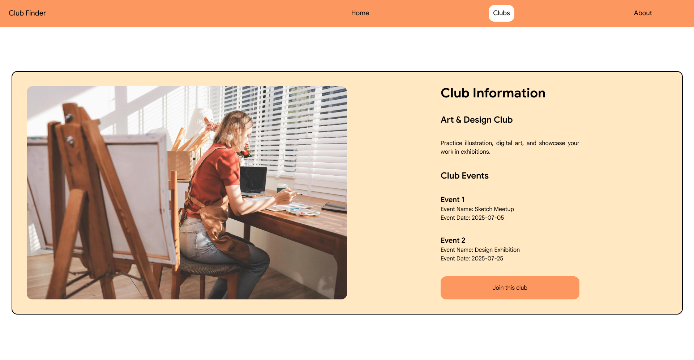

The clubname details page will display comprehensive information about the club selected by the user; this page also includes a "Join This Club" button. When this button is clicked, a confirmation prompt will appear asking whether the user wants to join the club. 

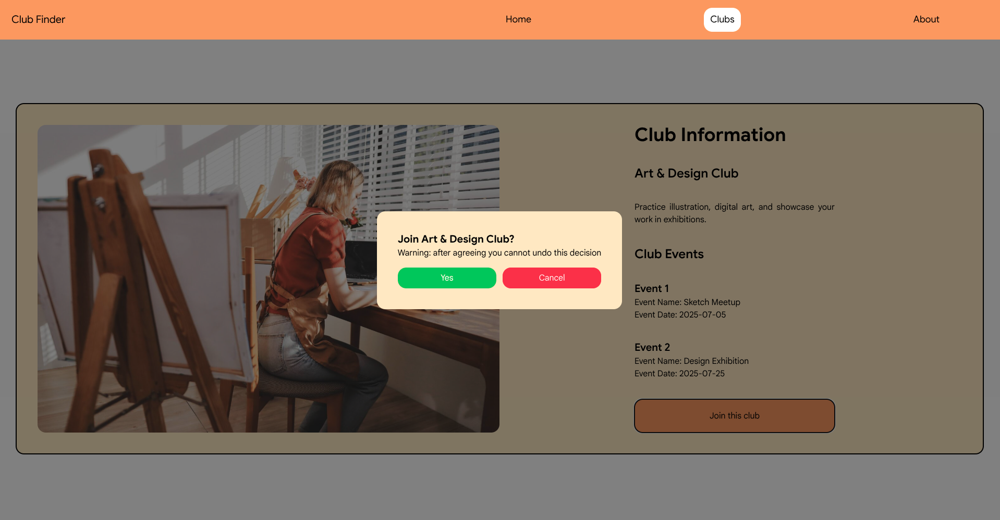

If the user declines, they will be redirected to the /club/:detailClubName page; however, if the user agrees, the user’s confirmation will be stored in local storage, and the button will change to "Already Joined" and its color will change. Once the user has joined, they cannot click the "Already Joined" button to leave the club.\
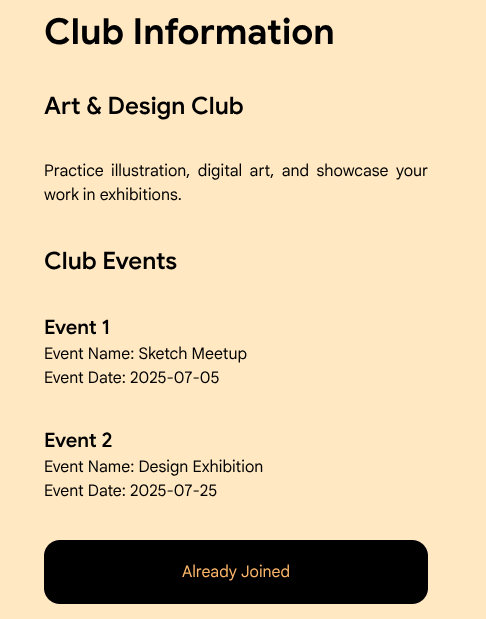

Users can still join other clubs without any restrictions.\
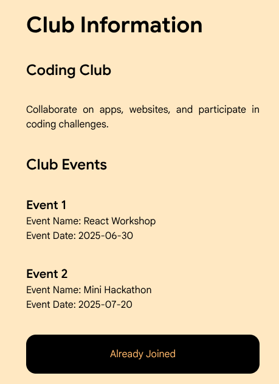

### 5. About
The "About" page contains a brief overview of this project
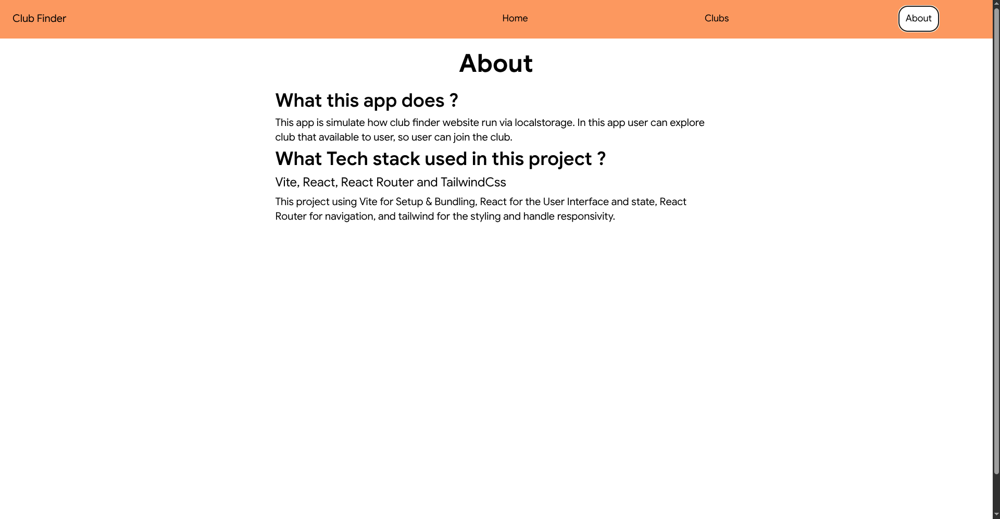

### 6. Not Found
The "Not Found" page is used as a guard for the / path, which is not available for users to browse.\
For example, a user tries to access the /test page\
\
"Not found" will appear 
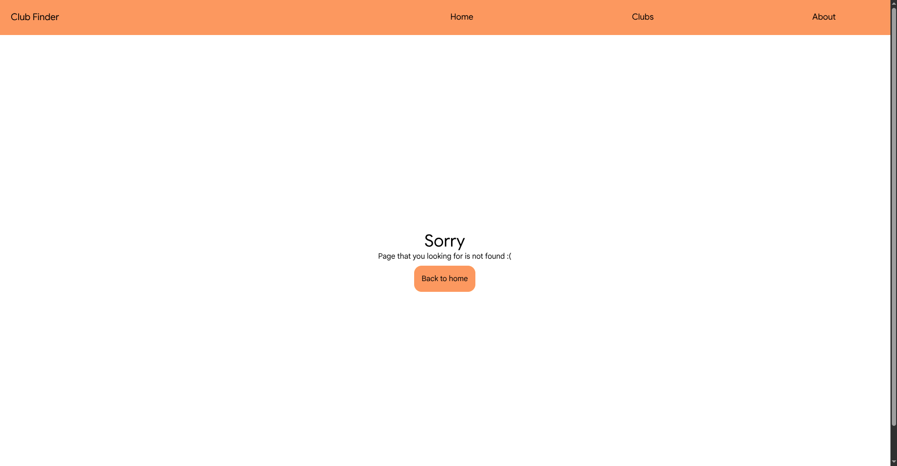